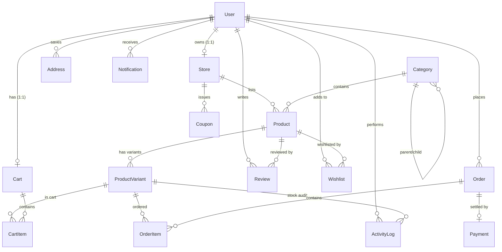

# VendorVerse — Multi-Vendor E-Commerce & Inventory Management Platform

An elite, high-performance multi-vendor e-commerce platform built for the **DevFusion 4.0 Hackathon (IIT Bombay)**.

VendorVerse bridges the gap for small sellers currently operating on messy WhatsApp catalogs, spreadsheets, and social media, providing a fully structured, real-time marketplace.

## Key Features

1. **AI-Powered Catalog Importer (Differentiator)**:
   - **Path A**: Importer takes informal WhatsApp messages (descriptions, Hinglish text, price, emojis) and product photos to generate structured listings in one step using **Gemini Flash**.
   - **Path B**: Messy spreadsheet parser maps inconsistent headers (e.g., "Cost/pc", "Stk", "Rate") to canonical database fields dynamically using LLM mappings.
   - Shows an editable review screen prior to publishing.

2. **Core Marketplace Loop**:
   - High-fidelity minimalist editorial landing page (Apple / COS / Aesop aesthetics).
   - Advanced search, filters (price, availability, rating, color, size), and sorting.
   - Full cart, save-for-later, and wishlist capabilities.
   - Razorpay payment gateway integration (UPI, credit/debit card, net banking).
   - Atomic inventory status management using Postgres row-level locking.

3. **Advanced Inventory Tracking**:
   - Stock status derived at read-time to prevent sync drift.
   - Restock ETA date picker or free-text note (e.g., "after Diwali") when stock hits 0.
   - Automatic customer restock alerts via Supabase Realtime linked to wishlist items.

4. **Multi-Role Dashboards**:
   - **Customer**: Manage active orders, addresses, wishlists, and notifications.
   - **Seller**: Track revenue, sales metrics, inventory alerts, and process orders.
   - **Admin**: Full control over users, stores, platform settings, coupons, and comprehensive audit logs.

---

## Tech Stack & Architecture

- **Frontend**: Next.js 16 (App Router), React 19, TypeScript, Tailwind CSS (Mobile-First Responsive)
- **Backend**: Next.js API Routes (Route Handlers)
- **Database**: PostgreSQL (Supabase)
- **ORM**: Prisma Client v6.3.0
- **Auth**: Supabase Auth (JWT session management, cookies)
- **Storage**: Supabase Storage (S3-compatible bucket, noted explicitly for S3 requirements)
- **Realtime**: Supabase Realtime (Live stock sync & instant notification streams)
- **Payments**: Razorpay (Test mode)
- **AI**: Gemini Flash / Flash-Lite API

---

## Database ER Diagram (Mermaid)



---

## Installation & Setup

### 1. Clone the Project & Install Dependencies

```bash
npm install
```

### 2. Set Up Environment Variables

Copy the `.env.example` file to `.env` and fill in your connection secrets:

```bash
cp .env.example .env
```

### 3. Database Migration & Generating Prisma Client

Run the migrations to create the database schemas and generate the typed client:

```bash
# Push schema changes to Supabase Postgres
npx prisma db push

# Generate the Prisma Client
npx prisma generate
```

### 4. Seed the Database

Seed the categories, platform settings, and default test accounts (Customer, Seller, Admin):

```bash
npx prisma db seed
```

#### Test Credentials Seeded:
- **Admin**: `admin@vendorverse.com` / `Admin@123456`
- **Seller**: `seller@vendorverse.com` / `Seller@123456` (Store: Orion Supply Co)
- **Customer**: `customer@vendorverse.com` / `Customer@123456`

### 5. Run the Local Server

```bash
npm run dev
```

The application will launch on [http://localhost:3000](http://localhost:3000).
